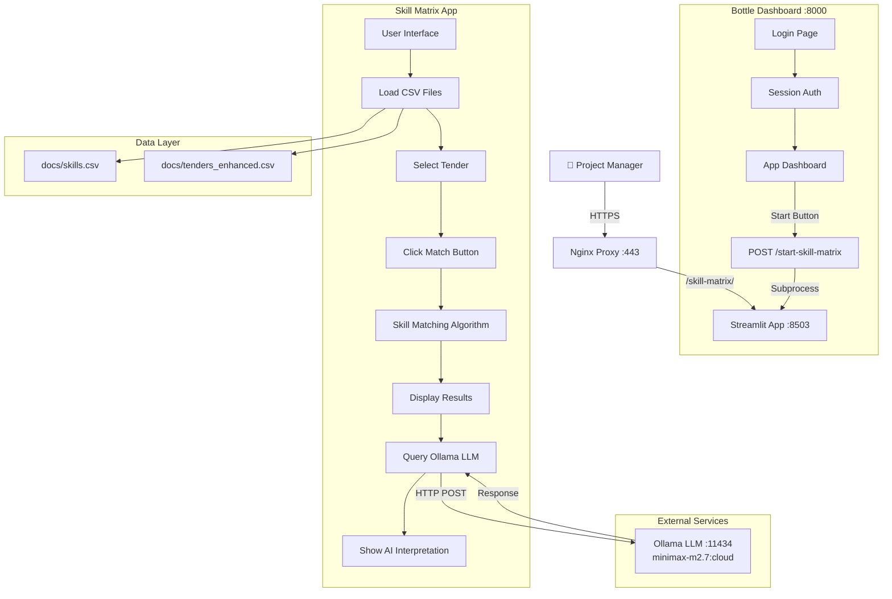
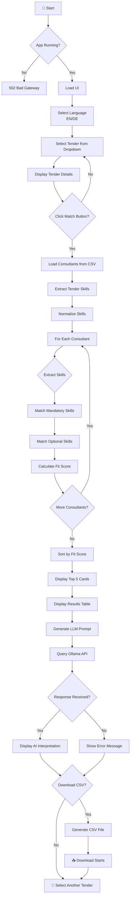
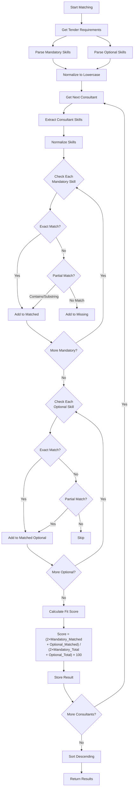
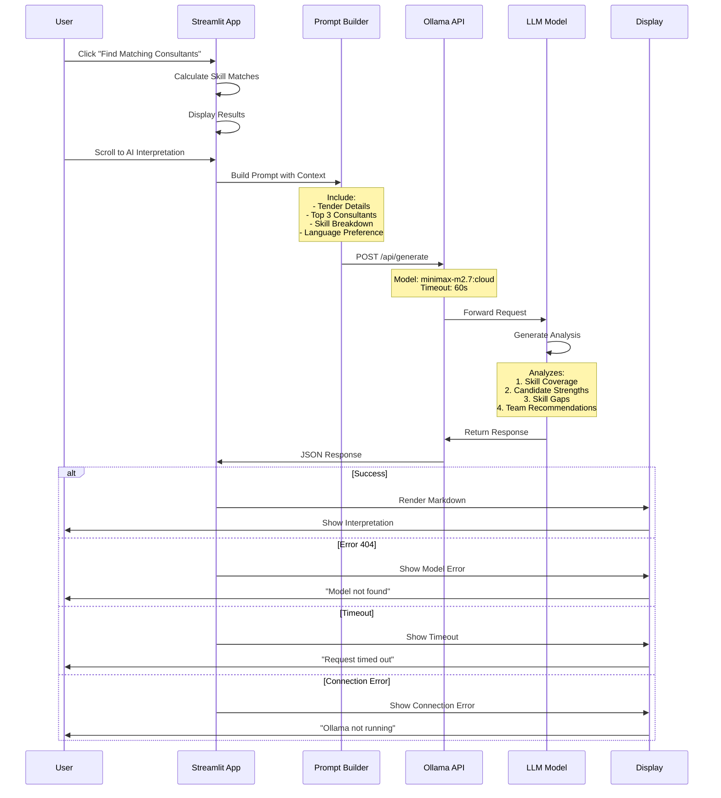
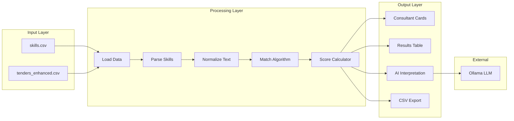
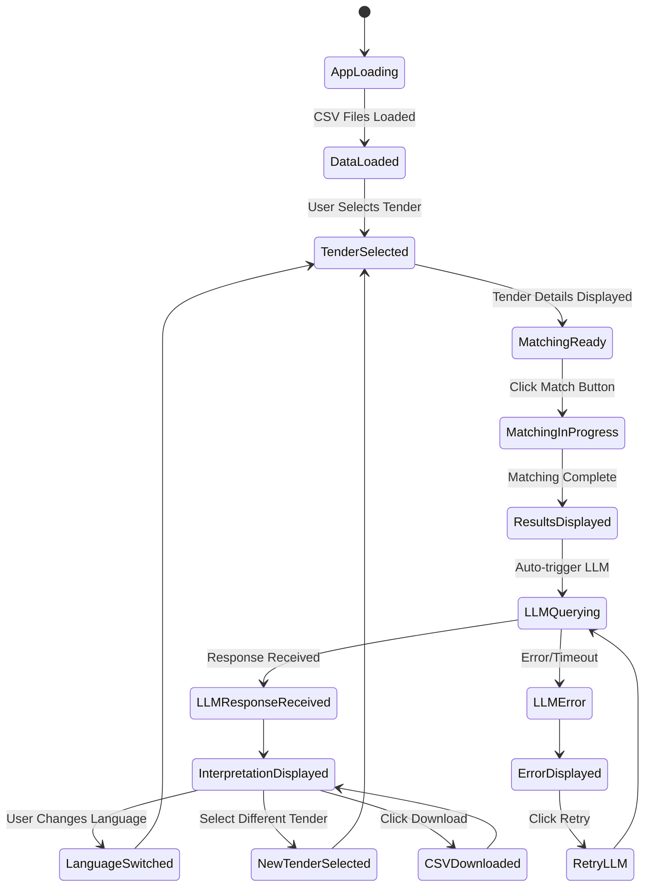
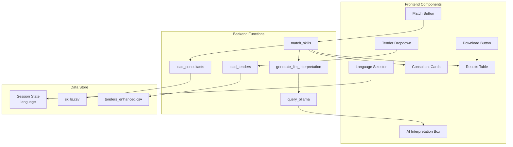
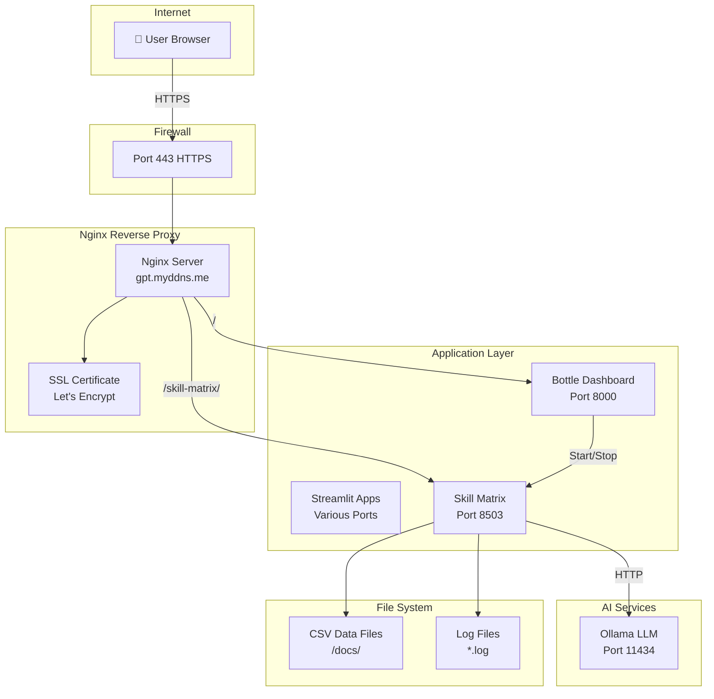
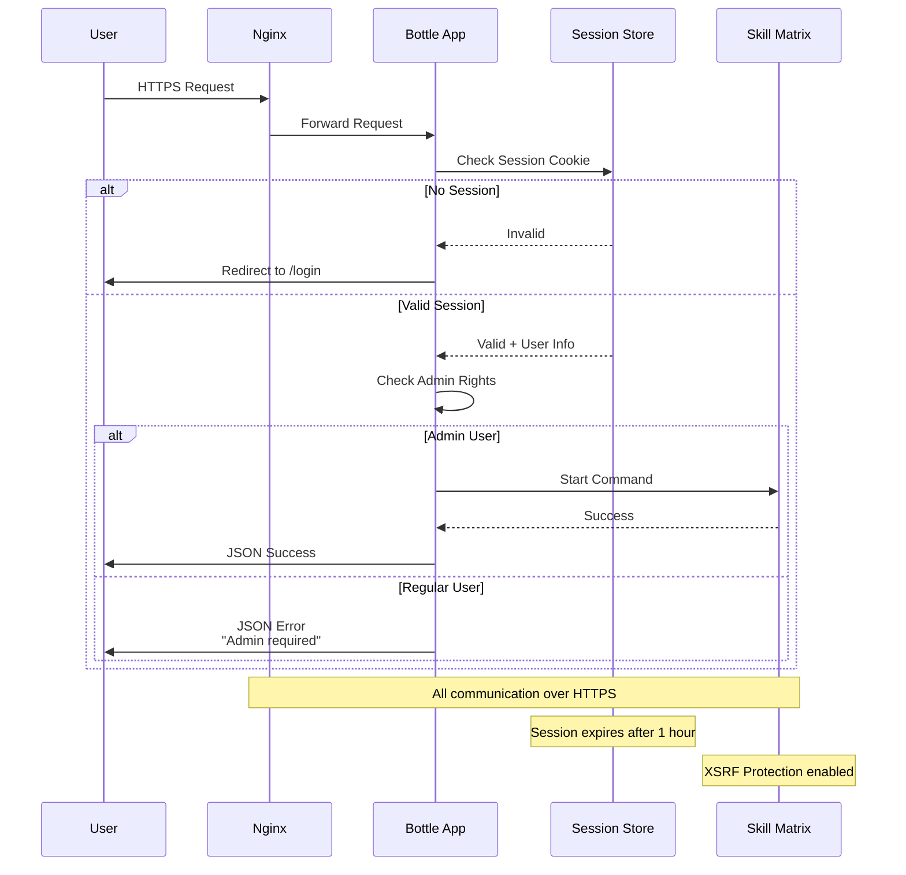

# 🔄 SAP Skill Matrix Match - Technical Flowchart

## System Architecture Flow



## Application Flow



## Skill Matching Algorithm



## LLM Integration Flow



## Data Flow Diagram



## State Management



## Component Interaction



## Error Handling Flow

```mermaid
flowchart TD
    A[Start Operation] --> B{Operation Type?}
    
    B -->|Load CSV| C{File Exists?}
    C -->|Yes| D[Load Successfully]
    C -->|No| E[Show Error<br/>"File not found"]
    
    B -->|Match Skills| F{Data Loaded?}
    F -->|Yes| G[Execute Matching]
    F -->|No| H[Show Error<br/>"Data not loaded"]
    
    B -->|Query LLM| I{Ollama Running?}
    I -->|No| J[Show Error<br/>"Ollama not running"]
    I -->|Yes| K{Model Available?}
    
    K -->|No| L[Show Error<br/>"Model not found"]
    K -->|Yes| M{Response Timeout?}
    
    M -->|Yes| N[Show Error<br/>"Request timed out"]
    M -->|No| O{HTTP Status?}
    
    O -->|200| P[Display Response]
    O -->|404| Q[Show Error<br/>"Model 404"]
    O -->|Other| R[Show Error<br/>"HTTP Error"]
    
    B -->|Download CSV| S{Results Available?}
    S -->|Yes| T[Generate CSV]
    S -->|No| U[Show Error<br/>"No results"]
```

## Deployment Architecture



## Security Flow



---

## Legend

| Symbol | Meaning |
|--------|---------|
| ▶ | Process Start |
| ◆ | Decision Point |
| ▭ | Process/Action |
| ◯ | Input/Output |
| → | Data Flow |
| ⇢ | Async Flow |
| [ ] | Subsystem |

## Document Info

- **Version**: 1.0
- **Last Updated**: March 2026
- **Author**: Development Team
- **Status**: Production
