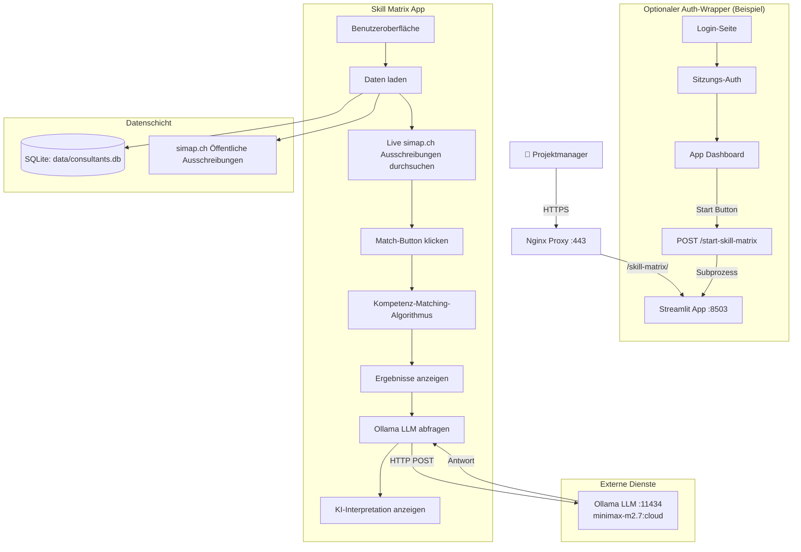
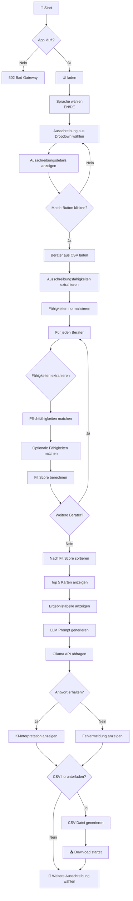
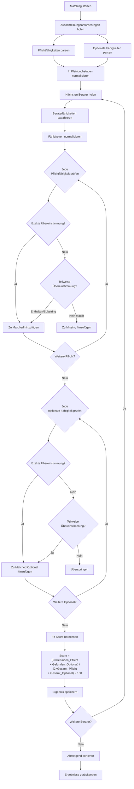
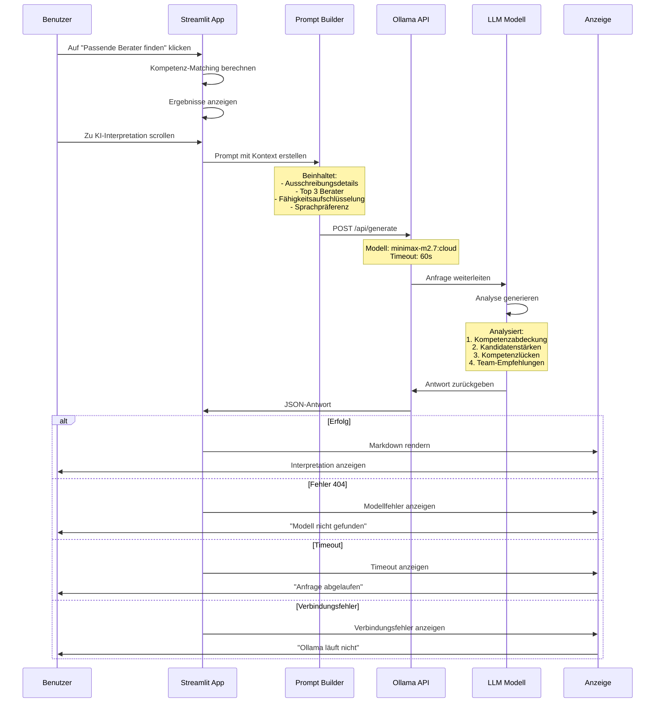
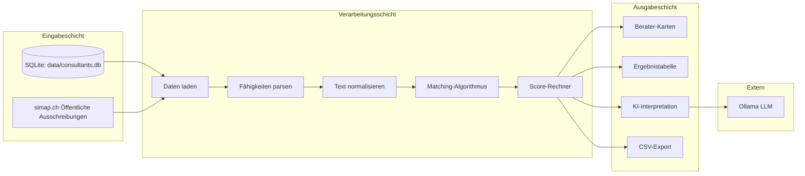
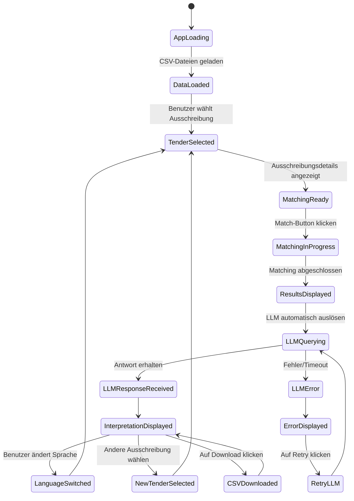
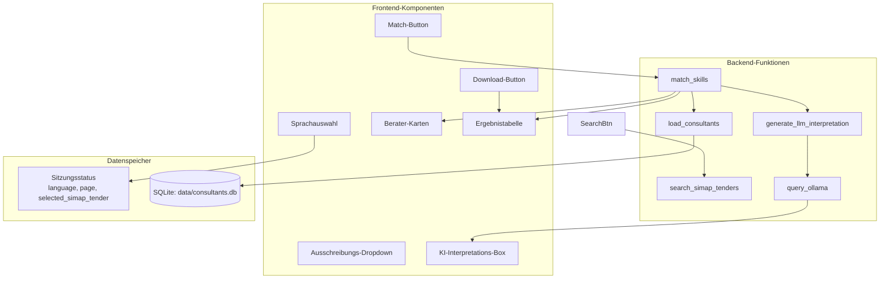
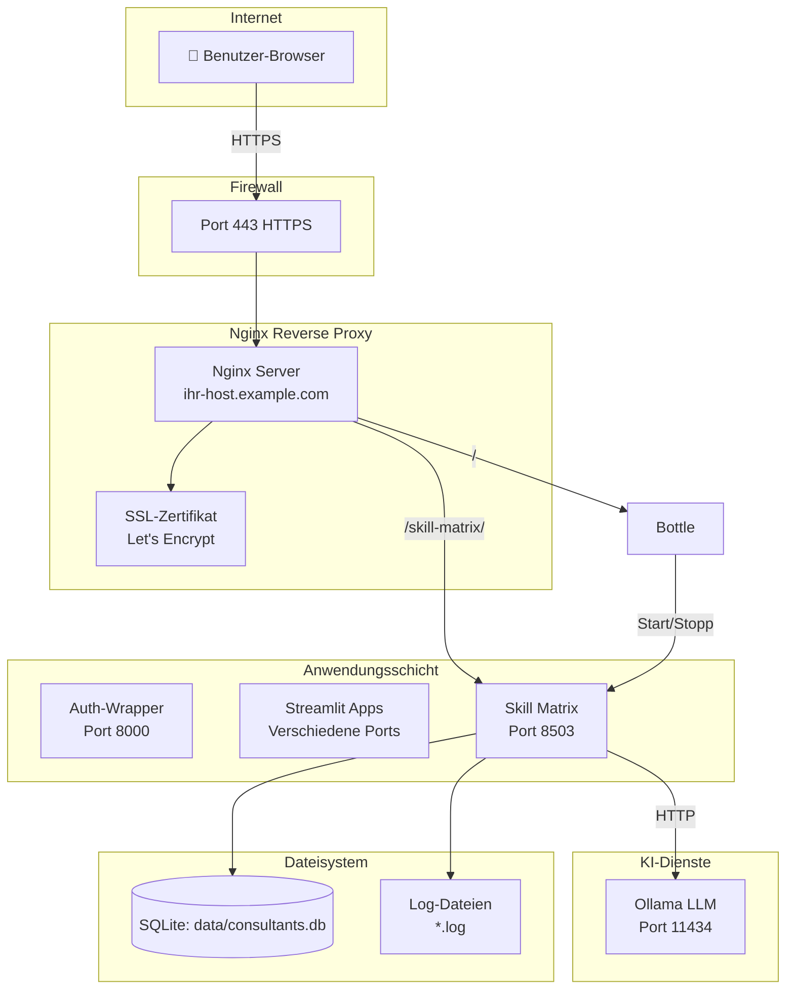
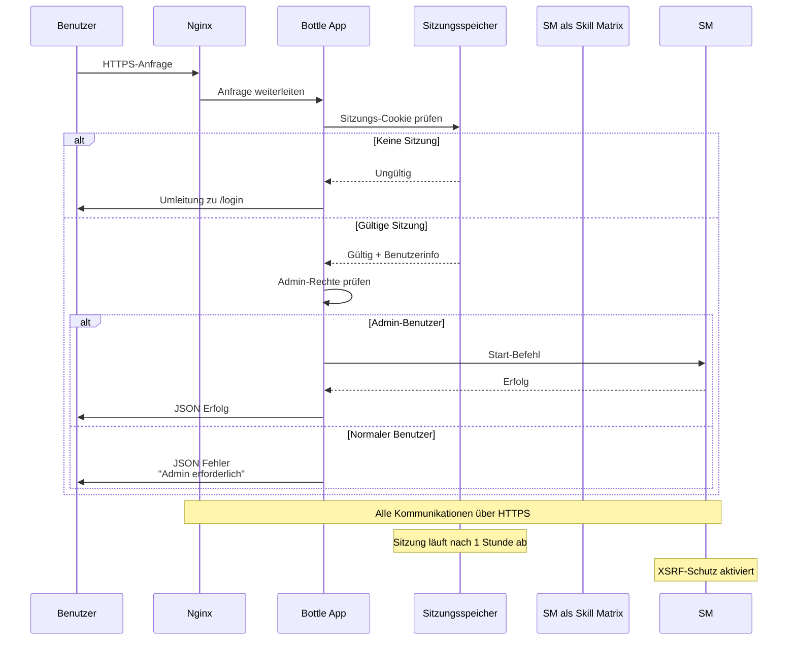

# 🔄 SAP Skill Matrix Match - Technischer Flussplan

## Systemarchitektur-Fluss



## Anwendungsablauf



## Kompetenz-Matching-Algorithmus



## LLM-Integrations-Fluss



## Datenflussdiagramm



## Zustandsverwaltung



## Komponenten-Interaktion



## Fehlerbehandlungs-Fluss

```mermaid
flowchart TD
    A[Vorgang starten] --> B{Vorgangstyp?}
    
    B -->|CSV laden| C{Datei existiert?}
    C -->|Ja| D[Erfolgreich laden]
    C -->|Nein| E[Fehler anzeigen<br/>"Datei nicht gefunden"]
    
    B -->|Matching| F{Daten geladen?}
    F -->|Ja| G[Matching ausführen]
    F -->|Nein| H[Fehler anzeigen<br/>"Daten nicht geladen"]
    
    B -->|LLM abfragen| I{Ollama läuft?}
    I -->|Nein| J[Fehler anzeigen<br/>"Ollama läuft nicht"]
    I -->|Ja| K{Modell verfügbar?}
    
    K -->|Nein| L[Fehler anzeigen<br/>"Modell nicht gefunden"]
    K -->|Ja| M{Antwort-Timeout?}
    
    M -->|Ja| N[Fehler anzeigen<br/>"Anfrage abgelaufen"]
    M -->|Nein| O{HTTP-Status?}
    
    O -->|200| P[Antwort anzeigen]
    O -->|404| Q[Fehler anzeigen<br/>"Modell 404"]
    O -->|Andere| R[Fehler anzeigen<br/>"HTTP-Fehler"]
    
    B -->|CSV herunterladen| S{Ergebnisse verfügbar?}
    S -->|Ja| T[CSV generieren]
    S -->|Nein| U[Fehler anzeigen<br/>"Keine Ergebnisse"]
```

## Bereitstellungsarchitektur



## Sicherheitsfluss



---

## Legende

| Symbol | Bedeutung |
|--------|-----------|
| ▶ | Prozessstart |
| ◆ | Entscheidungspunkt |
| ▭ | Prozess/Aktion |
| ◯ | Eingabe/Ausgabe |
| → | Datenfluss |
| ⇢ | Asynchroner Fluss |
| [ ] | Subsystem |

## Dokumenteninfo

- **Version**: 1.0
- **Zuletzt aktualisiert**: März 2026
- **Autor**: Entwicklungsteam
- **Status**: Produktion
